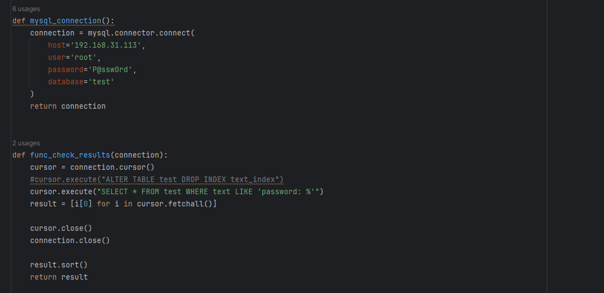
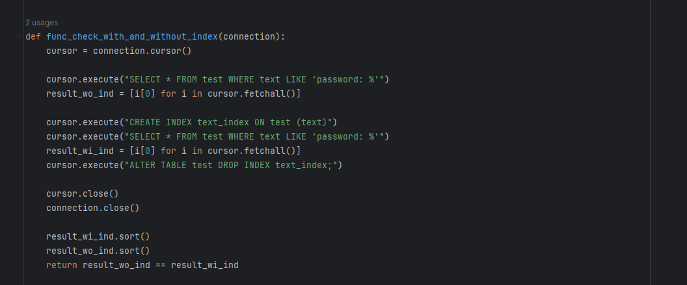
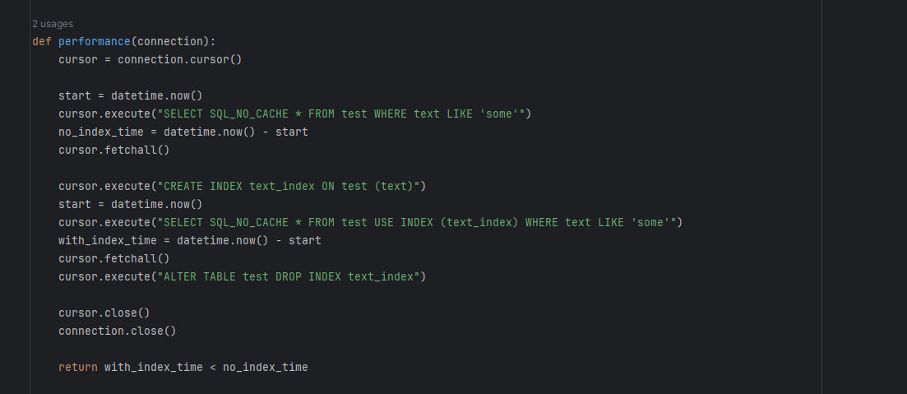
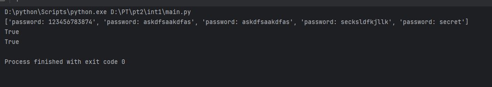
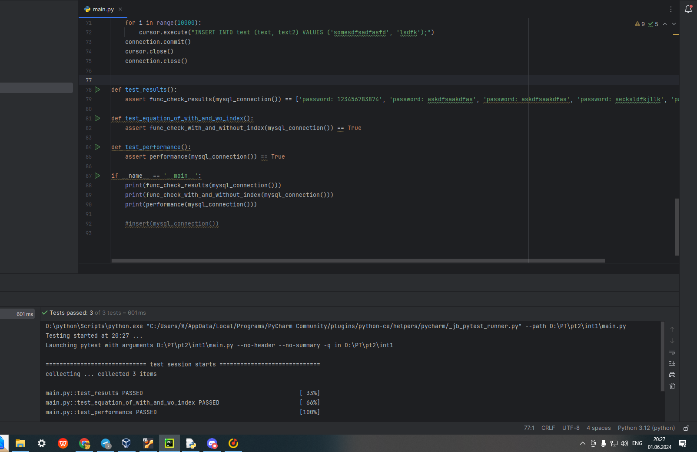
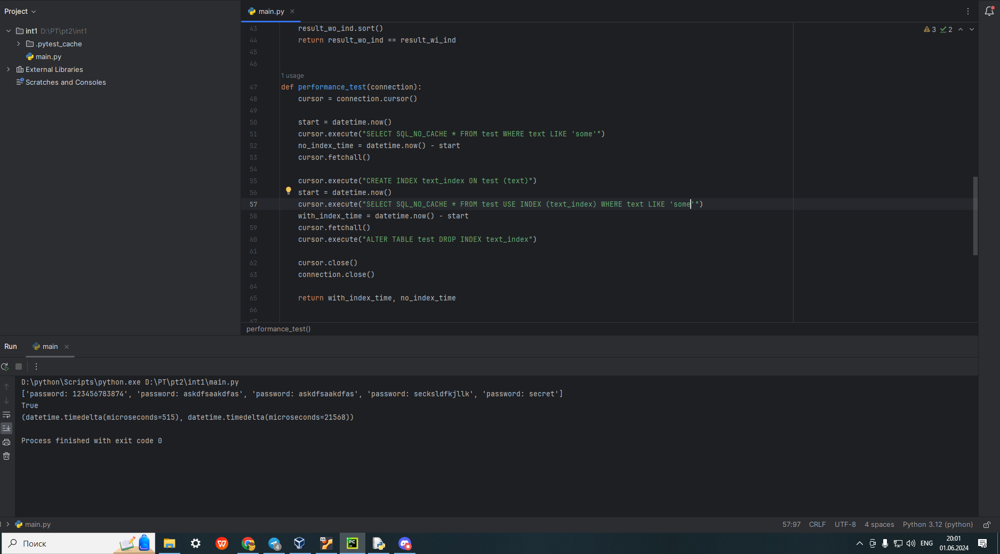
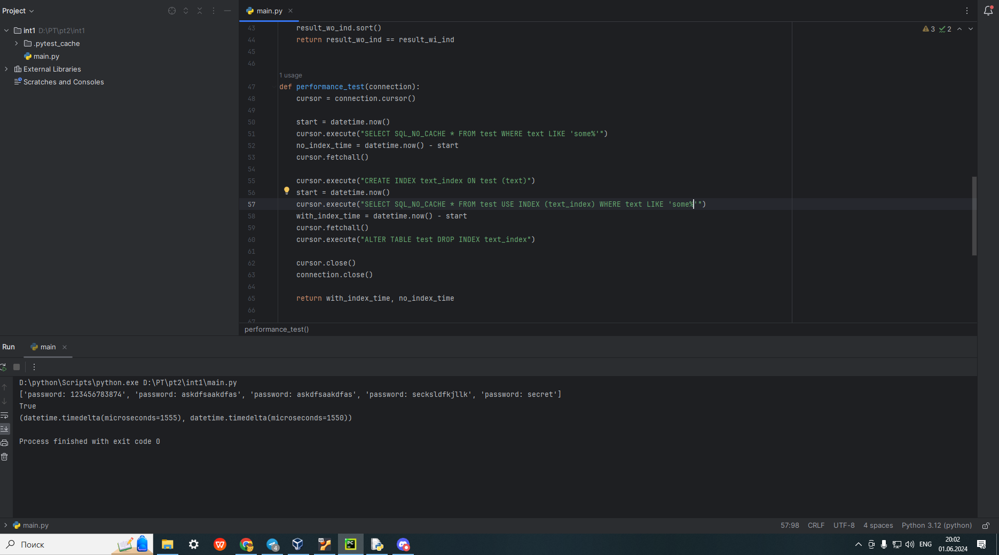
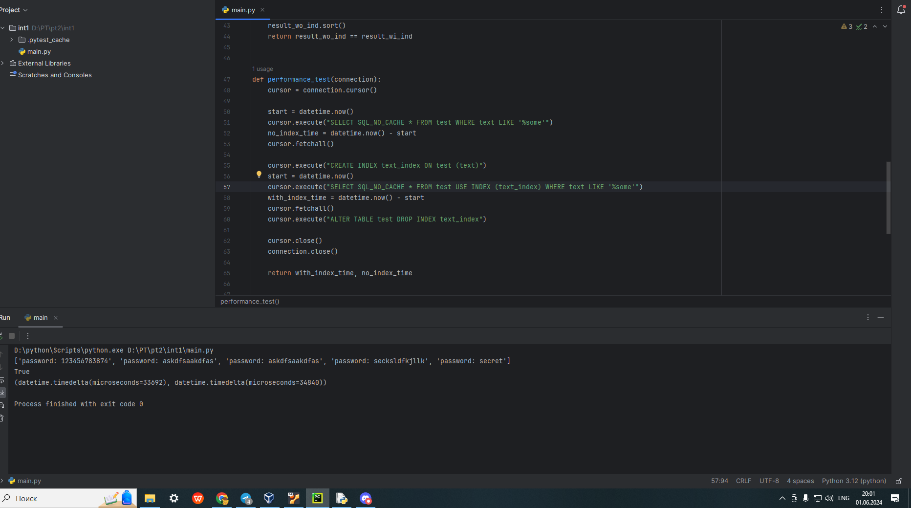

# Отчет по INT-1 Оводова Д. В.

## Основные функции

Функция для подключения к бд и функция для получения результатов SELECT

Функция для сравнения результатов SELECT с индексацией и без индексации

Функция для сравнения скорости выполнения SELECT с индексацией и без индексации

## Результаты выполнения программы

Результат программы main

Тесты и их успешное прохождение

## Примеры регулярных выражений, при которых не работает индексация

При поиске по подстроке индексация работает (слева результат с индексацией, справа без индексации)

При поиске по началу и концу строки индексация не работает

